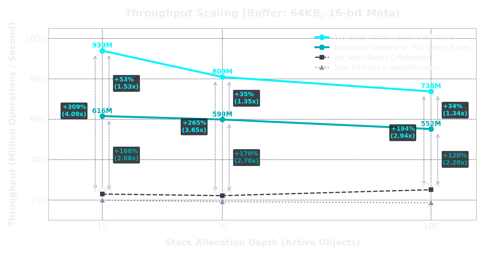
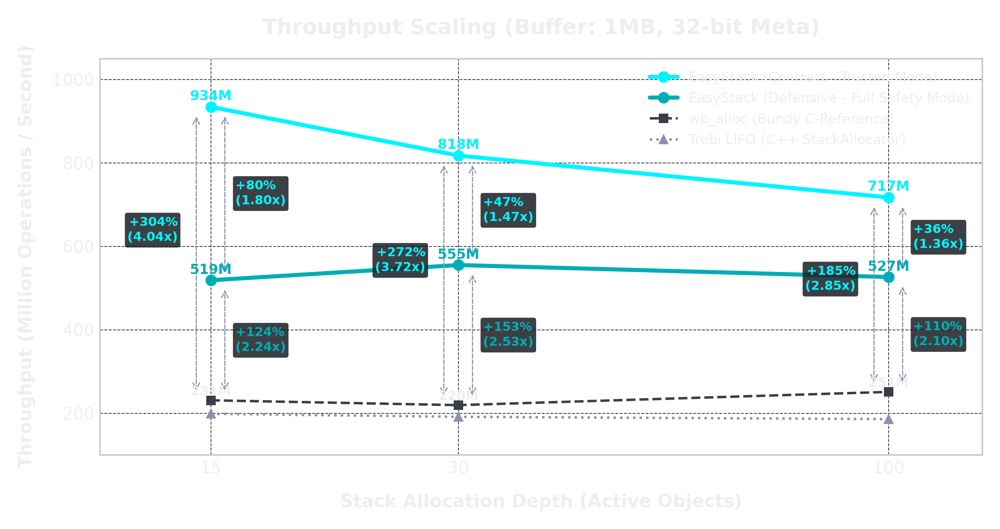
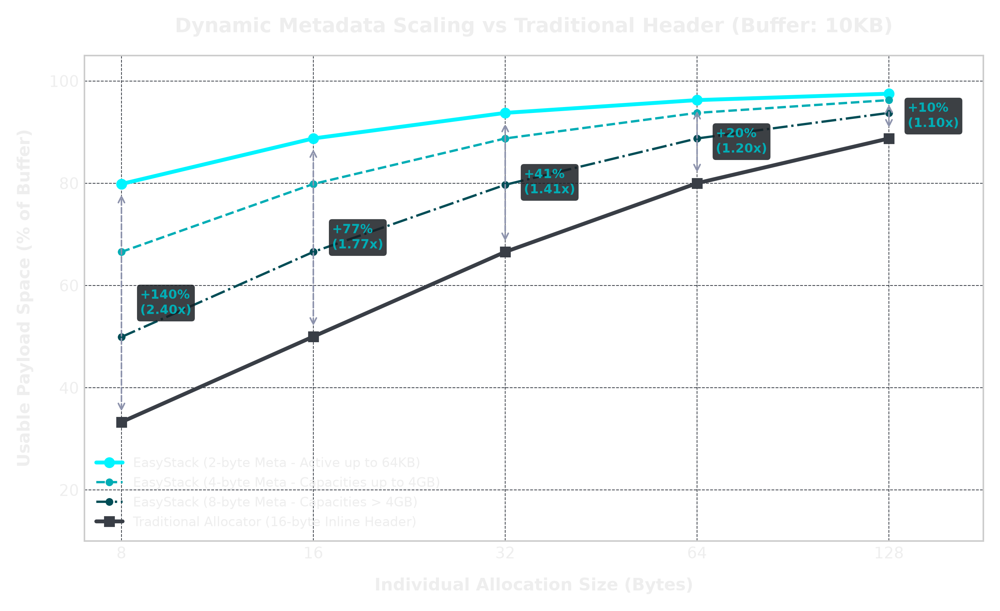

<table>
  <tr>
    <td width="150" valign="middle">
      
    </td>
    <td valign="middle">
      <div id="user-content-toc">
        <ul style="list-style: none; padding: 0; margin: 0;">
          <summary>
            <h1 style="margin: 0;">Header-Only LIFO Stack Allocator</h1>
            <h3>Complex inside. Simple outside.</h3>
          </summary>
        </ul>
      </div>
      <p style="margin-top: 10px; margin-bottom: 0;">
        <a href="https://opensource.org/licenses/MIT"></a>
        <a href="https://en.wikipedia.org/wiki/C11_(C_standard_revision)"></a>
        <a href="https://www.codefactor.io/repository/github/easymem/easy_stack"></a>
        <a href="https://codecov.io/gh/easymem/easy_stack"></a>
        <a href="https://github.com/easymem/easy_stack/actions/workflows/ci.yml"></a>
      </p>
    </td>
  </tr>
</table>

<br/>

**An absurdly fast, header-only, platform-agnostic, and safe LIFO stack allocator utilizing an inverted bi-directional buffer layout with dynamic metadata scaling.**

## TL;DR

**What is it?** A portable, extremely fast, single-header stack allocator that completely decouples control paths from aligned user payloads. It eliminates inline metadata overhead entirely by growing tracking offsets forward and aligned payloads backward.

**Why use it?** To achieve deterministic **O(1)** allocation and deallocation speeds that outperform traditional C allocators (like `wb_alloc`) by up to **4.1x+** and compile-time optimized C++ templates (like `Trebi`) by up to **4.7x+** in trusted mode (while remaining **2.5x+ faster** than both even with full runtime defensive safety active), all while retaining up to an **8x smaller metadata footprint**.

**How to use it?** `#define EASY_STACK_IMPLEMENTATION` in one `.c` file, then just `#include "easy_stack.h"`.

---

## Key Features

*   **Inverted Bi-Directional Layout:** Metadata offsets grow forward from the header (lowest addresses), while aligned user payloads grow backward from the end of the buffer (highest addresses). They meet in the middle. This physical segregation isolates metadata from payload alignment gaps, resulting in **zero alignment padding waste** in the control zone.
*   **Dynamic Metadata Bit-Width Scaling:** Unlike traditional stack allocators that prefix each allocation with a fixed-size inline header (typically 16 bytes on 64-bit platforms), `easy_stack` dynamically scales metadata cells to 1, 2, 4, or 8 bytes based on overall buffer capacity. For standard frame workloads (< 64 KB), offset cells take only 2 bytes—unlocking up to an **8x reduction in metadata overhead**.
*   **L1 Cache Line "Free Lunch" Optimization:** The compact `EStack` header requires only 2 machine words (16 bytes on 64-bit systems). By default, on modern desktop and application processors, the library automatically aligns the header boundary to 64-byte or 32-byte cache lines. This guarantees that fetching the stack header into cache automatically and instantly prefetches the **first 24 active metadata offsets** for **free**, bypassing main memory latency entirely.
*   **XOR-Hardened Stack Markers:** Rollback states (markers) are encrypted by XORing the current allocation index and signature with the stack's base memory address and `ESTACK_MAGIC`. This completely prevents cross-allocator marker pollution (e.g., passing Stack A's marker to Stack B) and detects forged marker rollbacks with **zero mathematical overhead** (1-cycle XOR instructions).
*   **Zero-Multiplication Boundary Checks:** Completely eliminates expensive CPU multiplication (`imul`) instructions from the critical allocation path. Since the metadata array cell widths are scaled strictly to powers of two ($1, 2, 4, \text{or } 8$ bytes), calculating the current metadata offset boundary is resolved using an ultra-fast bitwise shift left (`<< meta_type`). This reduces the boundary check to a single addition and shift, executing in just 1-2 CPU cycles.
*   **Arbitrary Power-of-Two Alignment:** Supports customized alignment boundaries (powers of two) for individual allocations, up to the stack's total capacity. Essential for SIMD vectors, cache-line aligned arrays, and hardware DMA buffers.
*   **Compiler Agnostic & Optimization Resilient:** Verified to work flawlessly across all compiler optimization levels (`-O1` through `-O3`, `-Os`, `-Oz`, `/O1`, `/O2`, `/Ox`). Built with strict adherence to **Strict Aliasing** rules, ensuring that aggressive compiler optimizations never break internal layout mechanics.
*   **Minimal Header Footprint:** The `EStack` header is extremely compact, consuming exactly 2 machine words (16 bytes on 64-bit systems, 8 bytes on 32-bit systems) to store overall capacity, dynamic metadata bit-width, allocation index, and the dynamic allocation flag. If `ESTACK_NO_ALIGN_HEADER` is defined (which is forced automatically on 8/16-bit platforms), the header alignment padding is completely eliminated to maximize usable space.
*   **Concurrency Model:** Intentionally lock-free and single-threaded to avoid mutex overhead. Designed for **Thread-Local Storage (TLS)** patterns (one `EStack` instance per thread).
*   **Embedded and Bare-Metal Ready:** Zero dependencies on standard `libc` heap managers. Can compile on bare-metal architectures with zero feature degradation (`ESTACK_NO_MALLOC`).
*   **Full C++ Compatibility:** Wrapped in `extern "C"` for seamless integration into both C and C++ codebases.

---

## Part of the EasyMem Ecosystem

While `easy_stack` is a powerful standalone allocator, it was originally designed and battle-tested as a core modular component of the `easy_memory` project — a full-fledged, general-purpose memory management system.

If your project requires **only** a fast LIFO stack, this library is the perfect, laser-focused tool.

If you need a complete memory toolbox to manage complex object lifecycles, eliminate heap fragmentation, or use advanced arenas, consider the full `easy_memory` library.

| Feature                          | `easy_stack` (This Library) | `easy_memory` (Full System) |
| :------------------------------: | :-------------------------: | :-------------------------: |
| **LIFO Stack Allocator**         |              [x]            |              [x]            |
| **Zero External Dependencies**   |              [x]            |              [x]            |
| **Single-Header (STB-style)**    |              [x]            |              [x]            |
| Ultra-Compact Header (16 bytes)  |              [x]            |              [ ]            |
| General Purpose Heap Allocator   |              [ ]            |              [x]            |
| Nested Scopes (Hierarchical)     |              [ ]            |              [x]            |
| Slab & Bump Allocators           |              [ ]            |              [x]            |
| LLRB-Tree Defragmentation Engine |              [ ]            |              [x]            |
| Scoped Scratchpad Reservations   |              [ ]            |              [x]            |

**[Check out the full `easy_memory` library here.](https://github.com/EasyMem/easy_memory)**

---

## Rigorous Validation

The library undergoes exhaustive testing to guarantee absolute correctness and resilience:
*   **Continuous Fuzzing Fleet:** Subjected to over **24 million chaotic runs** via `libFuzzer` target suites. Verified to withstand extreme, randomized combinations of allocations, strict LIFO pops, random marker rollbacks, unaligned boundaries, and deep Out-Of-Memory (OOM) states without a single crash, overflow, or leak.
*   **Sanitizer Suite:** Continuously verified with **ASan** (Address Sanitizer), **UBSan** (Undefined Behavior Sanitizer), and **LSan** (Leak Sanitizer).
*   **Valgrind Memcheck:** Fully verified with **0 errors from 0 contexts**.
*   **Pedantic Compilation:** Enforces "Warnings-as-Errors" (`-Werror`) policy on a comprehensive flag matrix:
    *   `-Wshadow`, `-Wconversion`, `-Wundef`, `-Wstrict-aliasing=2`, `-Wcast-align`, `-Wpadded`.
    *   `-Wint-to-pointer-cast`, `-Wpointer-to-int-cast`, `-Wdouble-promotion`, `-Wpointer-arith`.
*   **Platform Coverage:** Verified compatibility across **Linux**, **macOS**, and **Windows (MSVC & MinGW)**.

---

## Architecture

Traditional stack allocators suffix or prefix each payload with inline metadata (e.g., size, previous offset). This creates structural fragility, where user buffer overflows instantly corrupt allocator state, and wastes bytes by padding the metadata headers to align with the next user payload.

`easy_stack` solves this by introducing an **Inverted Bi-Directional Buffer Layout**:

```text
===============================================================================================
 INVERTED BI-DIRECTIONAL BUFFER LAYOUT
===============================================================================================

  Low Address                                                             High Address
 [ EStack Header ] [ Metadata Offset Array (Grows Forward) ──>]    [<── Payloads (Backward) ]
 ┌───────────────┐ ┌────────────┬────────────┬────────────┐        ┌────────────┬────────────┐
 │ capacity_meta │ │  Offset 0  │  Offset 1  │  Offset 2  │   ...  │  Payload 1 │  Payload 0 │
 │  meta_index   │ │ (uint16_t) │ (uint16_t) │ (uint16_t) │        │ (Aligned)  │ (Aligned)  │
 └───────────────┘ └────────────┴────────────┴────────────┘        └────────────┴────────────┘
                   └──────────── L1 Cache Line (Dense) ───┘        └─ aligned_ptr           
```

### The Physics of the Layout

1. **Decoupled Alignment:** Payloads are aligned backward at the end of the buffer. Metadata remains packed as a dense array of unaligned, scaled integers at the beginning of the buffer. Because metadata and payloads never sit inline next to each other, **no alignment padding is ever wasted in the control zone**.
2. **Dynamic Scaling:**
   * If capacity $\le$ 255 bytes: Offsets are stored as 1-byte `uint8_t` values.
   * If capacity $\le$ 65535 bytes: Offsets are stored as 2-byte `uint16_t` values.
   * If capacity $\le$ 4 GB: Offsets are stored as 4-byte `uint32_t` values.
   * Larger capacities scale to 8-byte `uint64_t` values.
3. **Collision Detection:** The allocation cursor checks if the aligned payload address is less than the end of the metadata array (`aligned_ptr < meta_end`). If true, a Stack Overflow is safely caught.

---

## Benchmarks & Performance

To verify execution speed, cache resilience, and scalability under load, `easy_stack` was benchmarked against popular alternatives:
*   **wb_alloc (Bundy):** A widely-used, minimalist C arena allocator.
*   **Trebi StackAllocator:** A standard C++ LIFO stack allocator (compiled with `-flto` for maximum devirtualization).

### Test Environment
*   **CPU:** AMD Ryzen 7 4700U (8 Cores / 8 Threads, Zen 2 @ up to 4.1 GHz)
*   **Compiler:** GCC 15.2 with `-O3 -flto -DNDEBUG`
*   **Scenario:** 2,000,000 iterations per run (executing up to 480,000,000 allocator operations) of nested allocations with randomized sizes (16-160 bytes) scaled across three distinct stack allocation depths (15, 30, and 100). Best of 25 runs.

### 1. Throughput & Cache-Line Scaling (Speed)

Rather than benchmarking only a single shallow depth, the suite tests scaling across three critical architectural boundaries. This highlights how cache layout and processor prefetching impact execution speed as stack depth increases.

#### Phase A: The Standard 64 KB Workload (16-bit Metadata)

With a 64 KB capacity, `easy_stack` configures itself to use ultra-compact **Type 1 (16-bit)** metadata offsets.

<p align="center">
  
</p>

At shallow depths (15 objects), the entire active allocator footprint (header + 30 bytes of metadata) fits completely into a **single 64-byte L1 cache line**. This yields a hardware-limit speed of **939 Million ops/sec** (~1.06 ns per allocation/free cycle) in Contract mode, outperforming the C++ template LIFO allocator by **371%**.

---

#### Phase B: The Transparent 1 MB Workload (32-bit Metadata)

> *"Wait a minute! You're cheating! By using a tiny 64 KB buffer, you guarantee that all metadata easily fits inside L1 cache. Let's see what happens on a larger stack."*

The objection is logically sound. To address this, the stack capacity was scaled up.

In **Defensive** and **Contract** modes, the capacity was increased to **1 MB**, automatically triggering the transition to 4-byte metadata offsets (`meta_type = 2`).

```bash
# Run benchmark with custom depth
make bench DEPTH=30
make bench DEPTH=100
```

This ensures that at depth 100, the metadata array alone spans multiple cache lines, removing any artificial L1 prefetching advantages. Here is how the allocator scales under the heavier 32-bit math path:

<p align="center">
  
</p>

#### Key Takeaways:

*   **Zero-Overhead Metadata Scaling:** 
    Comparing the 64 KB buffer (16-bit) vs the 1 MB buffer (32-bit), the throughput drop in Contract mode is **less than 0.5%** at depth 15 (**934 Million ops/sec** vs 939 Million) and only **2.7%** at depth 100 (**717 Million** vs 738 Million). This demonstrates that dynamically widening metadata cells has a negligible performance impact on modern superscalar architectures.
    
*   **Instruction Latency Hiding (Defensive Mode Stability):** 
    In Defensive (Safety) mode, throughput remains completely flat at a rock-solid **~520-550 Million ops/sec** across both 64 KB and 1 MB buffers, regardless of stack allocation depth. 
    
    The execution of defensive `if` branches and bounds checks occupies the ALU instruction pipeline. During this execution window, the CPU's prefetcher asynchronously loads upcoming metadata cache lines in the background. By the time safety checks are evaluated, the memory is already waiting in L1, resulting in a **zero-cycle memory stall**.
    
*   **Absolute Dominance:** 
    Even under full runtime safety checks and larger capacities, **EasyStack remains up to 191% faster than Trebi (C++) and 153% faster than wb_alloc (C)**.


### 2. Memory Efficiency (Payload vs. Overhead)

Traditional stack allocators prefix each block with a fixed 16-byte inline header (on 64-bit systems). On small allocations (common for temporary stacks), this inline overhead consumes up to **50%+ of your buffer**. 

`easy_stack` uses dynamically scaled metadata (only 2 bytes per allocation for buffers < 64KB). Since metadata is segregated from aligned payloads, **zero bytes are wasted on alignment padding in the control zone**.

Below is a comparison of usable payload space in a **10 KB buffer** across different allocation sizes:

<p align="center">
  
</p>

*   **For 8-byte allocations:** `easy_stack` lets you fit **2.40x more objects** into the same memory buffer (80% usable memory vs. 33%).
*   **For 16-byte allocations:** `easy_stack` lets you fit **1.77x more objects** into the same memory buffer (89% usable memory vs. 50%).

---
*Note: The chart above represents the absolute best-case scenario for the traditional allocator, assuming perfect power-of-two allocation sizes with 0 alignment padding. In real-world workloads with non-power-of-two sizes, traditional inline-header allocators suffer from internal fragmentation (wasting up to 7-15 bytes of alignment padding per block), which widens the efficiency gap even further in favor of `easy_stack`.*

## Usage

### 1. Integration
Include the header and define the implementation in **one** source C file.

```c
#define EASY_STACK_IMPLEMENTATION
// #define ESTACK_NO_MALLOC // Uncomment for bare-metal / no stdlib envs
#include "easy_stack.h"
```

Or compile it directly into its own object file:
```bash
# Example Makefile rule
easy_stack.o: easy_stack.h
	gcc -x c -DEASY_STACK_IMPLEMENTATION -c easy_stack.h -o easy_stack.o
```

### 2. Standard Heap Allocations (Dynamic)
Simple, linear LIFO allocations on a dynamically allocated heap.

```c
// Create a 64KB stack on the heap
EStack *stack = estack_create(1024 * 64);

// Standard allocation (default word alignment)
MyObject *obj = (MyObject *)estack_alloc(stack, sizeof(MyObject));

// Allocate aligned to 64-byte boundary
double *matrix = (double *)estack_alloc_aligned(stack, sizeof(double) * 16, 64);

// Deallocate in strict LIFO order (pop matrix first, then obj)
estack_free(stack, matrix);
estack_free(stack, obj);

// Release all resources and free heap memory
estack_destroy(stack);
```

### 3. Static / Bare-Metal Initialization (No Heap)
Excellent for memory-critical systems, RTOS tasks, and microcontrollers (ARM Cortex, Xtensa, AVR).

```c
#define EASY_STACK_IMPLEMENTATION
#define ESTACK_NO_MALLOC // Disables heap-based estack_create()
#include "easy_stack.h"

// Pre-allocate raw buffer on stack frame or as static global BSS with
// EXACTLY 1024 bytes of guaranteed usable payload capacity.
// The helper macro automatically handles header size and optimal alignment padding.
uint8_t memory_pool[ESTACK_REQUIRED_BUFFER_SIZE(1024)];

int main(void) {
    // Transform raw buffer into a safe, optimally aligned stack allocator
    EStack *stack = estack_create_static(memory_pool, sizeof(memory_pool));
    
    // Allocate word-aligned memory
    void *p = estack_alloc(stack, 256);
    
    // Free
    estack_free(stack, p);
    
    // Static stack destroy is a safe no-op (does not attempt to free memory_pool)
    estack_destroy(stack);
    return 0;
}
```

#### Microcontroller Optimization (Zero Alignment Waste)
For highly memory-constrained 8/16/32-bit microcontrollers, you can completely strip out all alignment math and padding gaps on both the header and user payloads:

```c
#define EASY_STACK_IMPLEMENTATION
#define ESTACK_NO_MALLOC       // Disable heap allocations
#define ESTACK_NO_AUTO_ALIGN   // Force 1-byte user payload alignment (no padding)
#define ESTACK_NO_ALIGN_HEADER // Force 1-byte header alignment (no padding, auto-enabled on 16-bit)
#include "easy_stack.h"

// Request EXACTLY 512 bytes of usable memory.
// Due to the optimization macros above, this array compiles to consume exactly:
//   - 520 bytes of RAM on 32-bit MCUs (8 bytes header + 512 bytes payload)
//   - 516 bytes of RAM on 16-bit MCUs (4 bytes header + 512 bytes payload)
// Absolutely zero bytes are wasted on alignment padding or compiler gaps!
uint8_t memory_pool[ESTACK_REQUIRED_BUFFER_SIZE(512)];
```

### 4. Rollback via Hardened Stack Markers
Rollback states are useful to clear temporary trees, parses, or render loops without individual deallocation overhead.

```c
EStack *stack = estack_create(2048);

void *p1 = estack_alloc(stack, 64);

// Take a secure, XOR-hardened snapshot of the current stack state
EStackMarker marker = estack_get_marker(stack);

// Make temporary allocations
void *temp1 = estack_alloc(stack, 128);
void *temp2 = estack_alloc(stack, 256);

// Instantly roll back to the snapshot (temp1 and temp2 are released in O(1))
estack_free_to_marker(stack, marker);

// Verification: we can re-allocate over the rolled-back space
void *p2 = estack_alloc(stack, 256); // p2 will occupy the space previously held by temp1/temp2

estack_destroy(stack);
```

### 5. Resets (Standard & Zeroed)
Instantly invalidate all active allocations, reusing the entire capacity from the start.

```c
// Mark all memory as free in O(1) without clearing data
estack_reset(stack);

// Mark all memory as free and physically overwrite the entire payload buffer with zeros
estack_reset_zero(stack);
```

---

## Configuration

Customize the library's behavior by defining macros **before** including `easy_stack.h`.

### Runtime Safety Policies (`ESTACK_SAFETY_POLICY`)

Controls the balance between absolute execution speed and runtime resilience.

| Policy | Mode | Description | Recommended For |
| :---: | :--- | :--- | :--- |
| **0** | **CONTRACT** | **Design-by-Contract.** All checks are delegated to `ESTACK_ASSERT`. Misuse leads to immediate abort (Debug) or UB (Release). | Performance-critical / Production-Tested |
| **1** | **DEFENSIVE** | **Fault-Tolerance (Default).** Performs robust 'if' checks. Gracefully returns `NULL` or exits on API misuse. | Production / General Purpose |

> [!IMPORTANT]
> **Structural Safety Guarantee:** 
> Even in **CONTRACT** mode with all assertions completely compiled out for Release, `easy_stack` remains **inherently safe against buffer overflows and stack collisions**. 
> The core collision detection boundary check (`aligned_ptr < meta_end`) is a fundamental structural part of the allocation algorithm itself and is **never compiled out**. The `CONTRACT` policy only strips away defensive API misuse validations (such as NULL-pointer sanitization or empty-stack pop checks), ensuring raw hardware-level performance without sacrificing memory safety boundaries.

### Assertion Strategy

Determines how the library handles internal invariant violations.

| Macro | Effect on Failure | Usage |
| :--- | :--- | :--- |
| **(Default)** | No-op | Assertions are compiled out. |
| `DEBUG` | Calls `assert()` | Standard C behavior. Aborts with file/line information. |
| `ESTACK_ASSERT_STAYS` | Calls `assert()` | **Forces assertions to remain active** even in Release builds. |
| `ESTACK_ASSERT_PANIC` | Calls `abort()` | Hardened release. Prevents exploitability on metadata corruption without leaking debug info. |
| `ESTACK_ASSERT_OPTIMIZE`| `__builtin_unreachable()` | **DANGER**. Uses assertions as compiler optimization hints. UB if condition is false. |
| `ESTACK_ASSERT(cond)` | **Custom** | Define this macro to implement custom error handling (e.g., logging, infinite loop, hardware reset). Overrides all other assertion flags. |

### Memory Poisoning

Helps detect use-after-free and uninitialized memory usage.

| Macro | Description |
| :--- | :--- |
| **(Default)** | Disabled in Release, Enabled in `DEBUG`. |
| `ESTACK_POISONING` | Force **ENABLE** poisoning (even in Release). Fills freed memory with `ESTACK_POISON_BYTE`. |
| `ESTACK_NO_POISONING` | Force **DISABLE** poisoning (even in `DEBUG`). Useful for performance profiling in debug builds. |
| `ESTACK_POISON_BYTE` | The byte value used for poisoning (Default: `0xDD`). |

### Linkage & Compilation Tuning

| Macro | Default | Description |
| :--- | :--- | :--- |
| `ESTACK_STATIC` | *None* | Declares all functions as `static`, limiting visibility to the current translation unit. |
| `ESTACK_RESTRICT` | *Auto* | Manually define the `restrict` keyword if your compiler does not support auto-detection. |
| `ESTACK_NO_ATTRIBUTES` | *None* | Force-disables all compiler-specific attributes (`malloc`, `alloc_size`). |
| `ESTACK_NO_AUTO_ALIGN` | *None* | Completely disables user payload alignment (forces 1-byte boundary). Highly recommended for 8/16-bit MCUs to save memory. |
| `ESTACK_NO_ALIGN_HEADER` | *None* | Completely disables context header alignment (forces 1-byte boundary). Automatically enabled on 8/16-bit systems to eliminate padding waste. |
| `ESTACK_DEFAULT_HEADER_ALIGNMENT` | *Auto* | Override the optimal context header alignment boundary (defaults to 64-byte for 64-bit, 32-byte for 32-bit platforms to prevent L1 cache line splits). |
| `ESTACK_NO_BRANCH_HINTS` | *None* | Completely disables compiler branch prediction hints (`ESTACK_LIKELY` and `ESTACK_UNLIKELY`). |
| `ESTACK_MAGIC` | `0xDEADBEEF..` | Magic number used for Stack Marker cryptographic XOR-encryption. |

---

## Build Status & Verified Platforms

The library is continuously integrated and tested across a matrix of OSs and Architectures.

| OS      | Status |
|---------|--------|
| Ubuntu  |  |
| macOS   |  |
| Windows |  |

### By Compiler

| Compiler    | Status |
|-------------|--------|
| GCC         |  |
| GCC (MinGW) | &logo=windows&logoColor=white) |
| Clang       |  |
| MSVC        |  |

### By Architecture
| Architecture | Endianness | OS / Environment | Status |
| :--- | :--- | :--- | :--- |
| `x86_64`  | Little  | Windows / Linux / macOS |  |
| `x86_32`  | Little  | Windows / Linux |  |
| `AArch64` | Little  | Windows (Native ARM64) / Linux |  |
| `ARMv7`   | Little  | Linux | %20%7C%20GCC&label=armv7&logo=arm&logoColor=white) |
| `s390x`   | **Big** | Linux |  |

### C Standards Compliance
| Standard | Status |
| :--- | :--- |
| **C99 / C11 / C17 / C23** |  |

### Hardware Verification (Bare Metal)

This library has been verified to run correctly on embedded hardware without standard library dependencies (`ESTACK_NO_MALLOC`).

| Architecture | Device | Status |
| :--- | :--- | :--- |
| **ARM Cortex-M0+** | Raspberry Pi Pico (RP2040) |  |
| **Xtensa LX6** | ESP32-WROOM |  |

---

## Why All This?
*idk, i was bored*

## Official Badges

Show support by adding the EStack badge to your project's README.

| Preview | Markdown (Copy & Paste) |
| :--- | :--- |
| [](https://github.com/EasyMem/easy_stack) | `[](https://github.com/EasyMem/easy_stack)` |
| [](https://github.com/EasyMem/easy_stack) | `[](https://github.com/EasyMem/easy_stack)` |
| [](https://github.com/EasyMem/easy_stack) | `[](https://github.com/EasyMem/easy_stack)` |
| [](https://github.com/EasyMem/easy_stack) | `[](https://github.com/EasyMem/easy_stack)` |

## Contributing

Contributions are welcome! Whether it's a bug fix, a new feature, or an improvement to the documentation, your input is valued. 

If you find an edge case on a specific architecture or want to improve the test coverage, feel free to open an issue or submit a Pull Request.

**Memory management in C doesn't have to be hard. Let's make it *easy*, together.**

## License
MIT License. See [LICENSE](LICENSE) for details.